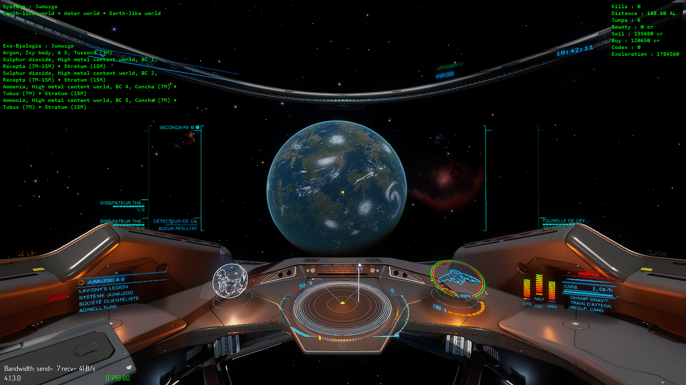

# HUD for Elite Dangerous



## 🧾 Description

This project is a custom Heads-Up Display (HUD) for Elite Dangerous that provides real-time information for exploration and exobiology, session statistics (coming soon), and tactical decision support (planned). It reads the game’s journal logs to extract key data such as your current system, credits earned, kills, targets scanned, and more. The HUD is designed to be fast and lightweight, with a clean interface built using Python’s tkinter, and leverages modules like pygame and requests for enhanced functionality.

## 🚀 Features
### System HUD
Displays interesting planets and stars to scan in your current system (Universal Cartographics)

### Exo-bio HUD
Displays the planets with potential exobiology and shows the possible hight-value species

### Session stats HUD
Displays: number of kills, total distance traveled, total jumps, bounties earned, total sales and purchases, new codex entries, exploration data sold, and session duration

### Others
- Simple UI with `tkinter` and `Pygame`
- Lightweight and efficient
- **Planned**: risk analysis

## ⚙️ Installation

### Prerequisites

- Python 3+
- Required modules:
  - `pygame`
  - `requests`
- Other modules are from the Python standard library

### Install dependencies

```bash
pip install -r requirements.txt
```

## Run the project

`python HUD_Launcher.py` in a terminal or run `HUD_Launcher.py` directly.
You can also run individual HUD modules directly, but this is not recommended due to potential overlay issues.

## 📄 License

This project is licensed under the [MIT License](./LICENSE).

